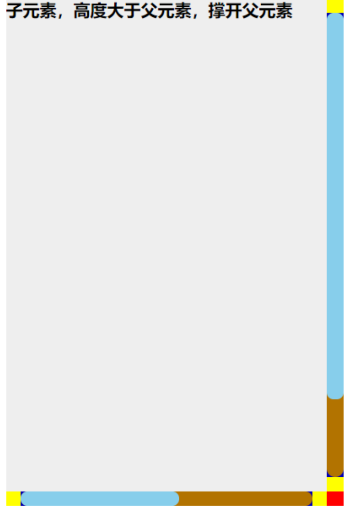
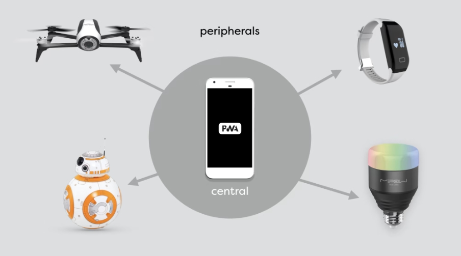
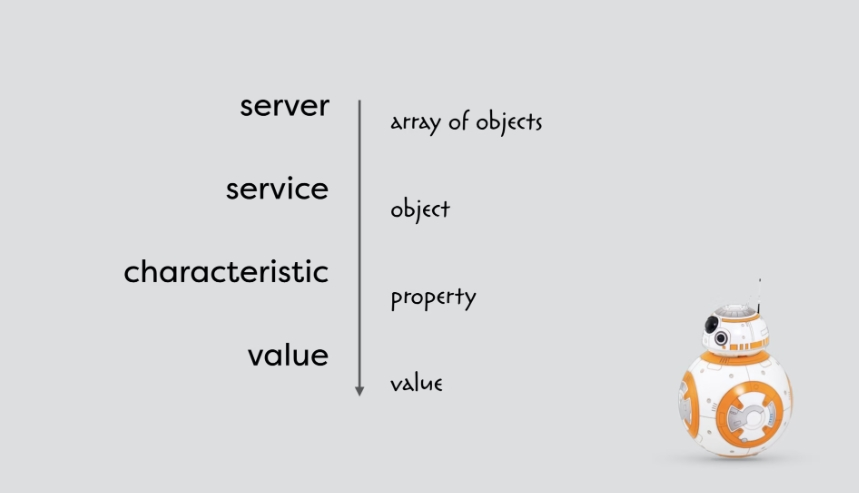

## umijs4.0

### umi 特性

1、企业级，在安全性、稳定性、最佳实践、约束能力方面会考虑更多
2、插件化，啥都能改，Umi 本身也是由插件构成
3、MFSU，比 Vite 还快的 Webpack 打包方案
4、基于 React Router 6 的完备路由
5、默认最快的请求
6、SSR & SSG
7、稳定白盒性能好的 ESLint 和 Jest
8、React 18 的框架级接入
9、Monorepo 最佳实践

### 什么时候不用 umi

1、需要支持 IE 8 或更低版本的浏览器
2、需要支持 React 16.8.0 以下的 React
3、需要跑在 Node 14 以下的环境中
4、有很强的 webpack 自定义需求和主观意愿
5、需要选择不同的路由方案

### 安装

```bash
yarn create @umijs/umi-app

// npm
npx create-umi@latest
// yarn
yarn create umi

// 安装必备@types
npm install -D @types/node @types/jest typescript
```

### 目录结构

```text
├── mock                  // mock文件所在目录，基于express
├── src                   // 源码目录
  ├── layouts/index.js    // 全局布局
  ├── pages               // 页面目录，里面的文件即路由
  ├── models              // 数据流
  ├── wrappers            // 权限管理
  ├── app.js              // 运行时配置文件
  ├── global.css          // 约定的全局样式文件，自动引入，也可以用global.less
  ├── global.js           // 可以在这里加入polyfill
├── .umirc.js             // umi配置，同config/config.js二选一
├── dist                  // 默认的build输出目录
├── publick               // 变通的数据资源目录和一些无需要打包的资源
├── .env                  // 环境变量

```

### 构建时配置

.umirc.ts

```js
const { PUBLIC_PATH = "/" } = process.env;
export default defineConfig({
  /*
   *内置插件配置
   */
  plugins: [
    "@umijs/plugins/dist/dva",
    "@umijs/plugins/dist/request",
    "@umijs/plugins/dist/model",
  ],
  /*
   *
   */
  /**
   * @name 开启 hash 模式
   * @description 让 build 之后的产物包含 hash 后缀。通常用于增量发布和避免浏览器加载缓存。
   * @doc https://umijs.org/docs/api/config#hash
   */
  hash: true,

  /**
   * @name 兼容性设置
   * @description 设置 ie11 不一定完美兼容，需要检查自己使用的所有依赖
   * @doc https://umijs.org/docs/api/config#targets
   */
  // targets: {
  //   ie: 11,
  // },
  /**
   * @name 路由的配置，不在路由中引入的文件不会编译
   * @description 只支持 path，component，routes，redirect，wrappers，title 的配置
   * @doc https://umijs.org/docs/guides/routes
   */
  // umi routes: https://umijs.org/docs/routing
  routes,
  /**
   * @name 主题的配置
   * @description 虽然叫主题，但是其实只是 less 的变量设置
   * 在src下创建global.less，更改根部的所有样式设置:root:root{--admin-color-primary:#399}
   * @doc antd的主题设置 https://ant.design/docs/react/customize-theme-cn
   * @doc umi 的theme 配置 https://umijs.org/docs/api/config#theme
   */
  theme: {
    // 如果不想要 configProvide 动态设置主题需要把这个设置为 default
    // 只有设置为 variable， 才能使用 configProvide 动态设置主色调
    "root-entry-name": "variable",
  },
  /**
   * @name moment 的国际化配置
   * @description 如果对国际化没有要求，打开之后能减少js的包大小
   * @doc https://umijs.org/docs/api/config#ignoremomentlocale
   */
  ignoreMomentLocale: true,
  /**
   * @name 代理配置
   * @description 可以让你的本地服务器代理到你的服务器上，这样你就可以访问服务器的数据了
   * @see 要注意以下 代理只能在本地开发时使用，build 之后就无法使用了。
   * @doc 代理介绍 https://umijs.org/docs/guides/proxy
   * @doc 代理配置 https://umijs.org/docs/api/config#proxy
   */
  // proxy: proxy[REACT_APP_ENV as keyof typeof proxy],
  proxy: {
    dev: {
      // localhost:8000/api/** -> https://preview.pro.ant.design/api/**
      "/api/": {
        // 要代理的地址
        target: "http://192.168.1.71:33353",
        // 配置了这个可以从 http 代理到 https
        // 依赖 origin 的功能可能需要这个，比如 cookie
        changeOrigin: true,
      },
    },
  },
  /**
   * @name 快速热更新配置
   * @description 快速刷新，可以保留组件state状态
   */
  fastRefresh: true,
  //============== 以下都是max的插件配置 ===============
  /**
   * @name 数据流插件
   * @@doc https://umijs.org/docs/max/data-flow
   */
  model: {},
  /**
   * 一个全局的初始数据流，可以用它在插件之间共享数据
   * @description 可以用来存放一些全局的数据，比如用户信息，或者一些全局的状态，全局初始状态在整个 Umi 项目的最开始创建。
   * @doc https://umijs.org/docs/max/data-flow#%E5%85%A8%E5%B1%80%E5%88%9D%E5%A7%8B%E7%8A%B6%E6%80%81
   */
  initialState: {},
  /**
   * @name layout 插件
   * @description 配置标题
   * @doc https://umijs.org/docs/max/layout-menu
   */
  title: "传承服务中心 - 控制台",
  /**
   * @name 标题icon
   * @description 配置icon 使用本地图片favicon.ico，请放到public中直接引用
   * @doc
   */
  favicon: "/favicon.ico",
  // 按需加载时指定的loading组件
  dynamicImport: {
    loading: "@/component/loading",
  },
  /**
   * @name 模版约定
   * @description 配置 react 组件树渲染到 HTML 中的元素 id，在pages下面创建documents.ejs
   */
  mountElementId: "app",
  layout: {
    locale: false,
    ...defaultSettings,
  },
  /**
   * @name moment2dayjs 插件
   * @description 将项目中的 moment 替换为 dayjs
   * @doc https://umijs.org/docs/max/moment2dayjs
   */
  moment2dayjs: {
    preset: "antd",
    plugins: ["duration"],
  },
  // 生产环境base与publicPath路径必须统一，如：'/'
  // const { PUBLIC_PATH = '/' } = process.env;
  publicPath: PUBLIC_PATH,
  base: PUBLIC_PATH,
  /**
   * @name 国际化插件
   * @doc https://umijs.org/docs/max/i18n
   */
  locale: {
    // default zh-CN
    default: "zh-CN",
    antd: true,
    // default true, when it is true, will use `navigator.language` overwrite default
    baseNavigator: true,
  },
  /**
   * @name antd 插件
   * @description 内置了 babel import 插件
   * @doc https://umijs.org/docs/max/antd#antd
   */
  antd: {},
  /**
   * @name 网络请求配置
   * @description 它基于 axios 和 ahooks 的 useRequest 提供了一套统一的网络请求和错误处理方案。
   * @doc https://umijs.org/docs/max/request
   */
  request: {},
  /**
   * @name 权限插件
   * @description 基于 initialState 的权限插件，必须先打开 initialState
   * @doc https://umijs.org/docs/max/access
   */
  access: {},
  /**
   * @name <head> 中额外的 script
   * @description 配置 <head> 中额外的 script
   * scripts放在public中
   */
  headScripts: [
    // 解决首次加载时白屏的问题
    {
      src: "/scripts/loading.js",
      async: true,
    },
    // 解决网络不好时富文本加载不出来的问题
    {
      src: "/scripts/tinymce.min.js",
      async: true,
    },
  ],
  //================ pro 插件配置 =================
  presets: ["umi-presets-pro"],
  /**
   * @name openAPI 插件的配置
   * @description 基于 openapi 的规范生成serve 和mock，能减少很多样板代码
   * @doc https://pro.ant.design/zh-cn/docs/openapi/
   */
  openAPI: [
    {
      requestLibPath: "import { request } from '@umijs/max'",
      // 或者使用在线的版本
      // schemaPath: "https://gw.alipayobjects.com/os/antfincdn/M%24jrzTTYJN/oneapi.json"
      schemaPath: join(__dirname, "oneapi.json"),
      mock: false,
    },
    {
      requestLibPath: "import { request } from '@umijs/max'",
      schemaPath:
        "https://gw.alipayobjects.com/os/antfincdn/CA1dOm%2631B/openapi.json",
      projectName: "swagger",
    },
  ],
  mfsu: {
    strategy: "normal",
  },
  requestRecord: {},
  // 设置本地开发环境配置安全证书
  // server.crt, server.key放在根目录下
  https: {
    cert: "./server.crt",
    key: "./server.key",
  },
  dva: {
    // 兼容ie 11
    immer: { enableES5: true },
    extraModels: [],
  },
});
```

### umi 内置

```bash
antd^4.0.0
antd-mobile^5.0.0
antd-mobile^2.3.4
基于 babel-plugin-import 做按需编译
```

- 查看某个插件的版本

```js
npm view @umijs/preset-react versions
```

- @umijs/preset-react:1.x
  需要升级到 2

- 按需要引入

```jsx
import {Button } from 'antd'
import {Button as V2Button} from 'antd-mobile-v2'
import {Button as V5Button} from 'antd-mobile-v5'

export default function indexPage() {
  return (
    <div>
      <Button type="primary">pc按钮</Button>
      <V2Button type="primary">mobile v2按钮</V2Button>
      <V5Button type="primary">mobile v5按钮</V2Button>
    </div>
  )
}
```

### 图片和资源引入

```css
.test1 {
  backgroud:url('../assets//images//bg.jpg') // 写死的图片会被转化为base64
  background: url('~@/assets//images//bg.jpg') // src/assets/images
  background: url('cdn链接')
  background: url('/img/bg.jpg') // 引入public中图片
}

```

### 样式模块化

#### 变量-全局

```css
@import "~antd/es/style/themes/default.less" .mylink {
  color: @primary-color;
  font-size: @font-size-base;
}
.title {
  background: #cornflowerblue;
}
```

```html
<div className="mylink">全局引入变量</div>
<div className="title">全局自定义变量</div>
```

#### 变量-局部

index.less

```css
@width: 100px;
@height: @width - 10px;

.header {
  width: @width;
  height: @height;
}
```

```jsx
// index.jsx
import styles frim './index.less'
export default function indexPage() {
  return (
    <div className={style.header}></div>
  )
}

```

#### 混合变量

```css
.bordered(@topW:1px, @bottomW:2px) {
  border-top: dotted @topW black;
  border-bottom: solid @bottomW black;
}

.a1 {
  color: #111;
  .bordered();
}
.a2 {
  color: red;
  .bordered(2px, 4px)
  border-bottom: solid 5px solid // 覆盖混合
}

```

#### 样式不添加 hash

```css
.bars_right {
  font-weight: bold;
  :global {
    .ant-btn {
      border: 0;
    }
  }
}
```

```html
<div className="{styles.bar_right}">
  <button className="{`ant-btn`}"></button> /*样式不添加hash*/
</div>
```

#### 修改原生 checkbox 样式

> 用 lable 标签的 for 属性，绑定到 input 标签上（for 属性对应到 input 标签中的 id）

```html
<div class="formItem">
  <input type="checkbox" name="Contract" id="Contract" />
  <label for="Contract">
    
    
  </label>
</div>
```

```css
input[type="checkbox"] {
  visibility: hidden;
}
#checked {
  display: none;
}
```

```js
// 点击#check 显示#checked,隐藏#check
// 点击#checked， 显示#check，隐藏#checked
```

## react-v18

### useState 与 useRef，useEffect

在数据请求时，业务应用情景：
搜索及筛选，包括搜索防抖处理

使用应响式数据 `useState`，在数据变化时，通过 `useEffect` 监听，监听多个值导致请求次数多，重复或被覆盖时，用 `useRef` 来写固定数据，偶有变化时 `useEffect` 监听 `useRef` 数据

### hooks+函数式编写组件

#### useEffect

> 用来在函数组件中添加副作用，例如发起网络请求，更新 dom 等操作

#### useMemo(()=>{},[])

> 用来缓存计算结果，提高组件渲染性能

类似 computed 属性

```jsx
// 关联更新数据的方法触发
// 触发条件：父组件更新时，不依赖数据的触发也会更新
// 父组件通过触发方法更新数据，只有依赖的数据的触发时进行更新=》useMemo()

// 默认情况下onClick方法会触发getNum方法，onChange也会触发getNum方法
// 阻止不依赖数据的更新：给getNum方法添加useMemo()，只有count更新时，关联的getNum方法才会更新，value更新时不触发getNum方法

export default testPage(){
  const [count, setCount] = useState(0)
  const [value, setValue] = useState('0')

  const getNumMemo = useMemo(()=> {
    console.log('data update);
    return count*100
  },[count])

  return (
    <>
    <h3>父组件</h3>
    <div>getNumMemo:{getNumMemo}</div>
    <button onClick={()=>setCount(count+1)}>+1</button>
    <input value={value} onChange={(e)=> setValue(e.target.value)}/>
    </>
  )

}

```

#### Memo(compoent)

> 高阶组件

```jsx
// 父子组件
// 触发条件：父组件更新时，不依赖数据的子组件也会更新
// 父组件通过触发方法更新数据时，不依赖的数据的子组件不更新=》Memo()

// 默认情况下onClick触发count更新时，onChange方法触发value也会更新子组件
// 解决useState的触发：将不依赖value数据的子组件用memo包裹，只有count更新，子组件更新

export default testPage(){
  const [count, setCount] = useState(0)
  const [value, setValue] = useState('0')

  return (
    <>
    <h3>父组件</h3>
    <div>getNumMemo:{getNumMemo}</div>
    <button onClick={()=>setCount(count+1)}>+1</button>
    <input value={value} onChange={(e)=> setValue(e.target.value)}/>
    <Child count={count}></Child>
    </>
  )

}

```

> 给不依赖触发数据的组件添加高阶组件 Memo

```jsx
// 子组件
import {Memo} from 'react'
const Child = ({count}){
  const show = ()=>console.log('rendered child component')

  return (
    <>
      <h3>child component</h3>
      <div>{show()}</div>
      <div>{count}</div>
    </>

  )
}
export default Memo(Child)
```

#### useCallback(()=>{},[])

> 用来缓存函数实例，避免不必要的渲染

```jsx
// 父子组件

// 默认情况下子组件onClick触发不依赖父组件数据时，父组件关联方法更新，父组件触发任意方法，子组件每次都更新
// 解决useState的触发：将不依赖value, count数据的子组件不更新，给触发方法添加useCallback
// 如果子数据依赖count变化时，给useCallback添加依赖项

export default testPage(){
  const [count, setCount] = useState(0)
  const [value, setValue] = useState('0')

  const updateCount = useCallback(()=>{
    console.log('parent componet update')
  })

  return (
    <>
    <h3>父组件</h3>
    <div>getNumMemo:{getNumMemo}</div>
    <button onClick={()=>setCount(count+1)}>+1</button>
    <input value={value} onChange={(e)=> setValue(e.target.value)}/>
    <Child updateCount={updateCount}></Child>
    </>
  )

}

```

```jsx
// 子组件
import {Memo} from 'react'
const Child = ({updateCount}){
  const show = ()=>console.log('rendered child component')

  return (
    <>
      <h3>child component</h3>
      <div>{show()}</div>
      <button onClick={updateCount}></button>
    </>

  )
}
export default Memo(Child)
```

#### useCallback+debounce(lodash)

```jsx
import { debounce } from "lodash";

export default () => {
  const handleSearchMembers = (val: string) => {
    if (val === "") return;
    let obj = {
      keyword: val ?? "",
      userType: 4,
      userIds: [],
    };
    searchAllMembers("project-member/search", obj).then((res) => {
      if (res.code === 200) {
        let list =
          res.data && res.data.length > 0
            ? res.data.map((item: APITYPE.AllMemDataItem) => ({
                label: item.name,
                value: item.id,
              }))
            : [];
        setAllMemberlist([...list]);
      }
    });
  };
  const handleSearch = useCallback(
    debounce((e) => handleSearchMembers(e), 500),
    []
  );
  return (
    <ProFormSelect
      name="member"
      label="设置成员"
      fieldProps={{
        mode: "multiple",
        searchOnFocus: true,
        onSearch: handleSearch,
      }}
      initialValue={currentMemVal}
      showSearch
      placeholder="请选择"
      options={allMemberlist}
    />
  );
};
```

#### useState

> 用来在函数组件中添加状态，能够代替类组件中的 state

#### useContext

> 用来在函数组件之间共享全局数据

#### useReducer

> 用来管理复杂状态或多个相关状态的更新

#### useRef

> 用来获取 dom 节点或缓存任何可变值，类似于类组件中的 ref 属性

### cache(fn)

#### 缓存代价昂贵的计算

#### 共享数据快照

#### 预加载数据

### 路由、权限、动态、约定式（理想状态）

#### 组件结构

```text
├── config
  ├──config.js
  ├── routes.ts

├── pages
  ├──login
    ├──index.jsx
    ├──index.less

```

#### layout 布局

```text
                layouts
                  ├
    ──────────────────────────────
    ├                             ├
components                      children
    ├                             ├
  nav           ──────────────────────────────
                ├                             ├
        layouts/layouts2                ────────────────
                ├                       ├       ├       ├
        ───────────────────             pages   pages   pages
        ├                  ├             ├       ├        ├
  components           children          1       2       ...
        ├                  ├
        menu             pages
                          ├
              ──────────────────────────
              ├       ├       ├         ├
              page1  page2   page3    page4


```

**路由布局示例**

```js
export default [
  {
    path: '/'
    component: '@/layouts/base-layout',
    routes: [
      {path: '/login',component: '@/pages/login'},
      {path: '/reg', component: '@/pages/reg'},
      {path: '/', redirect: '/login'},
      {path: '*', layout: false, component: '@/pages/404'},
      {
        path: '/goods',
        wrapper: ['@/pages/auth'],
        component: '@/layouts/aside-layout',
        routes: [
          {path: '/goods', component: '@/pages/goods'},
          {path: '/goods/:id', component: '@/pages/goods/goods-detail'},
          {path: '/goods/:id/comment', component: '@/pages/goods/comment'},
          {path: '/goods/:id/comment/:cid', component: '@/pages/goods/comment-detail'}
        ]
      }
    ]
  },
  {path: '*', layout: false, component: '@/pages/404'}
]

```

注：配置路由组件的包装组件，通过包装组件可以为当前的路由组件组合进更多的功能。 比如，可以用于路由级别的权限校验

**页面布局示例**

- base-layout

```jsx
export default function BaseLayout(props) {
  return (
    <>
      <Nav></Nav>
      <div>{props.children}</div>
    </>
  );
}
```

- asid-layout

```jsx
export default function AsideLayout(props) {
  return (
    <>
      <Menu></Menu>
      <div>{props.children}</div>
    </>
  );
}
```

```jsx
import {Redirect} from 'umi'
// wrapper/auth.jsx
export default (props)=>{
  if(Math.random < .5) {
    return <div>{props.children}</div>
  } else {
    return <Redirect to={} />
  }
}

```

#### 页面跳转、参数接收

#### 声明式

**navLink/Link -v3**

```html
<NavLink
 activeStyle={{color: red}}
 to={{pathname: '/goods/3', search: '?a=2'}}></NavLink>

 <NavLink
 activeStyle={{color: red}}
 to={{pathname: '/goods/4', query: {a: 2}}}></NavLink>

```

**NavLink/Link -v4**

```html
<ul>
    <li><NavLink to="message" style={({ isActive }) => isActive ? { color: 'red' } : undefined}>Messages</NavLink></li>
    <li><NavLink to="tasks" className={({ isActive }) => isActive ? 'active' : undefined}>Tasks</NavLink></li>
    <li><NavLink to="blog">{({ isActive }) => <span className={isActive ? 'active' : undefined}>Blog</span>}</NavLink></li>
</ul>

```

#### 编程式

**v3**

- useLocation

hooks，获取 location 对象: `location.pathname`

- useParams

hooks，获取 params 对象。 params 对象为动态路由（例如：/users/:id）里的参数键值对

- useRouteMatch

获取当前路由的匹配信息:`useRouteMatch().params`

- useHistory

```jsx
export default function test() {
  const history = useHistory();
  const goLink = () => {
    history.push({
      pathname: "/goods/3",
      query: { b: 1 },
    });
  };

  return (
    <>
      <button onClick={goLink}>编程式跳转</button>
    </>
  );
}
```

- withRouter

高阶组件，可以通过 withRouter 获取到 history、location、match 对象

```jsx
export defautl withRouter((history,location,match)=>{
  return (<></>)
})

```

**v4**

- useMatch

```JS

const match = useMatch('/comp/:id')
// match
{
  "params": {
    "id": "paramId"
  },
  "pathname": "/comp/paramId/",
  "pathnameBase": "/comp/paramId",
  "pattern": {
    "path": "/comp/:id",
    "caseSensitive": false,
    "end": true
  }
}
```

- useLocation

```jsx
{
  "pathname": "/path/",
  "search": "",
  "hash": "",
  "state": null,
  "key": "default"
}
```

> 🚨 推荐使用 `useLocation`, 而不是直接访问 `history.location.` 两者的区别是 `pathname` 的部分。 `history.location.pathname` 是完整的浏览器的路径名；而 `useLocation` 中返回的 `pathname` 是相对项目配置的 base 的路径
> 🚨 举例：项目如果配置 `base: '/testbase'`, 当前浏览器地址为 `https://localhost:8000/testbase/page/apple` > `history.location.pathname` 为 `/testbase/page/apple` > `useLocation().pathname`为 `/page/apple`

- useParams

```js
// 路由配置 /comp/:id
// 当前 location /comp/paramId

const params  = useParams();
// params
{
  "id": "paramId"
}
```

- useSearchParamms

```js
// 当前 location /comp?a=b;
const [searchParams, setSearchParams] = useSearchParams();
searchParams.get("a"); // b
searchParams.toString(); // a=b

setSearchParams({ a: "c", d: "e" }); // location 变成 /comp?a=c&d=e
```

### mock

模拟延时：roadhog-api-doc

```js
import {delay} from 'roadhog-api-doc
export default delay({
  '/api/user': {id: 12345, name: 'Olivia'}
}, 2000)

```

**v4**

- mock 使用，默认 get 请求

```js
export default {
  // 默认get方法
  "/api/users": { id: 10000, name: "Olivia" },
  "/api/users/1": [
    { id: 100001, name: "foo" },
    { id: 100002, name: "woo" },
  ],
  // 后面可接自定义函数
  "POST /api/login": (req: any, res: any) => {
    const { username, password } = req.body;
    if (username === "Olivia" && password === "abc123") {
      res.send({
        code: 200,
        data: {},
        message: "success",
      });
    } else if (username === "admin" && password === "admin123") {
      res.send({
        code: 200,
        data: {},
        message: "success",
      });
    } else {
      res.send({
        code: 201,
        message: "failed",
      });
    }
  },
};
```

- 可以用 roadhog-api-doc 模拟请求延时

```js
import { delay } from "roadhog-api-doc";
export default delay(
  {
    "/api/user": { id: 12345, name: "Olivia" },
  },
  2000
);
```

- mockjs

```js
import mockjs from "mockjs";

export default {
  // 使用 mockjs 等三方库
  "GET /api/tags": mockjs.mock({
    "list|100": [{ name: "@city", "value|1-100": 50, "type|0-2": 1 }],
  }),
};
```

mockjs 模拟条数数据

```js
import { delay } from "roadhog-api-doc";
import mockjs from "mockjs";

export default delay(
  {
    "/api/list": (req, res) => {
      const { page = 1, limit = 3 } = req.body;
      const totalPage = 3;
      const lastPageLimit = 2; // 尾页条数
      const total = limit * (totalPage - 1) + lastPageLimit;
      res.send({
        code: 200,
        data: {
          page,
          limit,
          total,
          ...mockjs.mock({
            [`data|${page > totalPage ? lastPageLimit : limit}`]: [
              {
                "id|+1": 1,
                create_at: "@date('yyyy-MM-dd HH:mm:ss')",
                "type_str|1": ["aaaaaa", "bbbbbbb", "cccc", "dddddddd"],
                name: function () {
                  return [
                    mockjs.mock('@datetime("MMdd")'),
                    mockjs.mock("@country()"),
                    this.operator,
                  ].join("-");
                },
                path: "http://www.baidu.com",
                operator: "@cname",
                "status|1": ["0", "2", "3", "4"],
              },
            ],
          }),
        },
      });
    },
  },
  2000
);
```

### 请求配置

#### useRequest()

> 需要安装`@umijs/hooks`

第一种：`const {data, error, loading, run, cancel, fetches, loadingMore, loadMore} = useRequest('/api/user')`
第二种：`const {data, error, loading, run} = useRequest('/proxy/aaaaaaa')` 反向代理
第三咱：`const { data, error, loading, run } = useRequest((userId)=> `/api/userInfo/${userId}`);`
第四种：

```js
import { useRequest } from "@umijs/hooks";
const { data, error, loading, run } = useRequest(
  {
    url: "/api/login",
    method: "post",
    data: {
      username: "aaa",
      password: "123aaa",
    },
  },
  {
    manual: true,
  }
);
```

**options 属性**

- 手动请求 manual
  `manual`为`true`阻止初始化默认请求，只有触发`run`时才会开始执行。

  ```jsx
  import { useRequest } from '@umijs/hooks';
  ​
  export default () => {
  const { run, loading } = useRequest(changeUsername, {manual: true})

  return (
    <Button onClick={() => run('new name')} loading={loading}>
       Edit
    </Button>
    )
  }
  ```

- 轮洵 poilingInterval

自动定时发起网络请求

```jsx
import { useRequest } from '@umijs/hooks';
​
export default () => {
  const { data } = useRequest(getUsername, { pollingInterval: 1000, pollingWhenHidden: false })
​
  return <div>Username: {data}</div>
}
```

同时通过设置`pollingWhenHidden`，我们可以智能的实现在屏幕隐藏时，暂停轮询。等屏幕恢复可见时，继续请求，以节省资源。为 false 时屏幕不可见时，轮洵暂停

当然你也可以通过`run/cancel`来手动控制定时器的开启和关闭。

- 并行请求 fetchKey

并行请求有几个特点： 1)删除 n 个不同的用户，则需要维护 n 个请求状态。 2)多次删除同一个用户，则只需要维护最后一个请求。

`useRequest` 通过设置 `fetchKey `，即可对请求进行分类。相同分类的请求，只会维护一份状态。不同分类的请求，则会维护多份状态。在下面的代码中，我们通过 `userId` 将请求进行分类，同时我们可以通过 `fetches[userId]` 拿到当前分类的请求状态！

```jsx
export default () => {
  const { run, fetches } = useRequest(deleteUser, {
    manual: true,
    fetchKey: id => id, // 不同的 ID，分类不同
  });
​
  return (
    <div>
      <Button loading={fetches.A?.loading} onClick={() => { run('A') }}>删除 1</Button>
      <Button loading={fetches.B?.loading} onClick={() => { run('B') }}>删除 2</Button>
      <Button loading={fetches.C?.loading} onClick={() => { run('C') }}>删除 3</Button>
    </div>
  );
};
```

- 防抖 debounceInterval&节流 throttleInterval

在下面的例子中，无论调用了多少次`run` ，只会在输入停止后，发送一次请求。

```jsx
import { useRequest } from '@umijs/hooks';
​
export default () => {
  const { data, loading, run, cancel } = useRequest(getEmail, {
    debounceInterval: 500,
    manual: true
  });
​
  return (
    <div>
      <Select onSearch={run} loading={loading}>
        {data && data.map(i => <Option key={i} value={i}>{i}</Option>)}
      </Select>
    </div>
  );
};
```

- 缓存 & SWR & 预加载(cacheKey)

在 SWR 场景下，我们会对接口数据进行缓存，当下次请求该接口时，我们会先返回缓存的数据，同时，在背后发起新的网络请求，待新数据拿到后，重新触发渲染

```jsx
const { data, loading } = useRequest(getArticle, {
  cacheKey: "articleKey",
});
```

> 🚨 注意：同一个 cacheKey 的数据是全局共享的

- 屏幕聚焦重新发起请求 refreshOnWindowFocus

- 分页 paginated

`useRequest` 通过配置 `paginated = true` ，即可进入分页模式，自动帮你处理表格常见逻辑，同时我们对 `antd Table` 做了特殊支持

```jsx
import {useRequest} from '@umijs/hooks';
​
export default () => {
  const [gender, setGender] = useState('male');
  const { tableProps } = useRequest((params)=>{
    return getTableData({...params, gender})
  },
  {
    paginated: true,
    refreshDeps: [gender]
  });
​
  const columns = [];
​
  return (
    <Table columns={columns} rowKey="email" {...tableProps}/>
  );
};

```

- 加载更多 loadMore

```jsx
const { data, loading, loadMore, loadingMore } = useRequest(
  (d) => getLoadMoreList(d?.nextId, 3),
  {
    loadMore: true,
    cacheKey: "loadMoreDemoCacheId",
    fetchKey: (d) => `${d?.nextId}-`,
  }
);
```

- loadingDelay

通过设置 `loadingDelay` ，延迟 `loading` 变为 `true` 的时间，当请求很快响应时，可以有效避免 `loading` 变化导致的抖动。

### 键盘监听包-keymaster

### dva

#### model 设置

> 等同 redux
> 所有状态管理数据放在 model 文件夹下
> state:数据状态
> reducers: 修改同步操作
> effects: 修改异步操作，action 类型，第一个参是 action,第二个参是 options{put, call,select}, put 触发 action,call 调用异步逻辑，select 用于从 state 中获取数据
> subscriptions: 自定义监听事件 fn({dispatch, history}),

**model 在项目全局中**

- 目录结构

```text
├── pages
├── model
  ├── global.js
```

```js
// model/global.js
export default {
  namespace: 'global',
  state: {
    title: 'global hello world',
    text: 'global text',
    login: fasle,
    a: 'global a'
  },
  reducers: {
    setText(state) {
      return {
        ...state,
        text: 'set global text'
      }
    },
    // 同步修改传参
    setTtile(state, action) {
      return {
        ...state,
        title: `set global title:${action.payload.a}/${actiono.payload.b}`
      }
    },
    signIn(state, action)=>({
      ...state,
      login: true
    })
  },
  // 异步修改
  effects: {
    *getLogin(action, {put, call, select}){
      // 发送异步请求
      const res = yield call(request, '/api/login', {
        method: 'post',
        data: {
          username: action.payload.username,
          password: action.payload.password
        }
      })
      // 将异步请求数据放进同步操作reduces.signIn中
      yield put({type: 'signIn', payload: res})
    }
  }
}
```

**model 在对应的组件中**

- 目录结构

```text
├── pages
  ├── dva
    ├── models
      ├── a.js
      ├── b.js
    ├── index.jsx
    ├── model.js
```

- 只有一个模块数据

```js
// model.js
export default {
  namespace: "dva",
  state: "only one model state",
};
```

- 有多个模块数据

```js
// models/a.js
export default {
  namespace: 'a',
  state: {
    a: 'part dva state a'
  }
}

// models/b.js
export default {
  namespace: 'b',
  state: {
    b: 'part dva state b'
  },
  reducers: {
    setDataB(state) {
      return 'part page dva state b'
    }
  }
}
```

#### 与组件连接 connect

```jsx
import {connect} from 'umi'
const mapModelToProps = (models) => {
  return {
    title: models.global.title,
    text: models.global.text,
    login: models.global.login,
    globalA: models.global.a,
    // 获取局部model数据
    partdva: models.dva,
    parta: models.a,
    partb: models.b
  }
}

@connect(mapModelToProps)

export default testPage(props){

  const handleGlobalClick = (props)=> {
    props.dispatch({
      type: 'global/setTtile',
      payload: {a: 'global aa', b: 'global bb'}
    })
  }

  const handlePartClick = (props)=> {
    props.dispatch({
      type: 'a/setDataB',
    })
  }

  const handleEffectsClick = (props) => {
    props.dispatch({
      type: 'global/signIn',
      payload: {username: 'admin', password: 'admin123'}
    })
  }

  return (<>
  <h3>获取全局state</h3>
  <div>title:{props.title}</div>
  <div>text:{props.text}</div>
  <div>globalA:{props.globalA}</div>
  {props.login ? <div>已登录</div> : <div>未登录</div>}
  <button onClick={handlGlobalClick(props)}></button>

  <h3>获取局部state</h3>
  <div>model中数据:{props.partdva}</div>
  <div>models/a中数据:{props.parta}</div>
  <div>models/b中数据:{props.partb}</div>
  <button onClick={handlePartClick(props)}>修改models/a/state.b</button>

  <h3>发送异步请求</h3>
  <button onClick={handleEffectsClick(props)}>发送effects请求</button>
  </>)
}
```

### 路由权限

#### wrappers 实现路由权限

> 结合第三方认证登录示例

**给所有路由添加需要权限访问的 wrappers**

```js
// 用户相关的页面路由配置
  user: [
    {
      path: '/accountManagement',
      component: '@/pages/modules/user/accountManagement/index.tsx',
      name: '账户管理',
      layout: false,
      auth: true,
      wrappers: ['@/pages/wrappers/index'],
    },
    {
      path: '/authentication',
      component: '@/pages/modules/user/authentication/index.tsx',
      name: '认证',
      layout: false,
      auth: true,
      wrappers: ['@/pages/wrappers/index'],
    },
  ],
```

**wrappers 页面设置**

```js
// src/pages/wrappers/index.tsx
import SpinLoading from "@/components/SpinLoading";
import { getLoginInfo, getLoginToken } from "@/service/api/login";
import {
  generatePKCE,
  generateRandomStr,
  getBaseUrl,
  getPushUrl,
  removeLocal,
} from "@/utils/auth";
import { localCache } from "@/utils/cache";
import { getToken, setToken } from "@/utils/cookie";
import { Toast } from "antd-mobile";
import { useEffect, useRef, useState } from "react";
import { Outlet, history, useLocation, useSearchParams } from "umi";

const AuthPage = (props: any) => {
  const pcke = useRef(generatePKCE());
  const location = useLocation();
  const [searchParams] = useSearchParams();
  const code = searchParams.get("code");
  const state = searchParams.get("state");
  const [isAuth, setAuth] = useState(false);
  // 用户信息
  const handleLogin = async () => {
    let authState = generateRandomStr(32);
    localCache.setCache("init_state", authState);
    localCache.setCache("init_codeChallenge", pcke.current.codeVerifier);
    let codeChallenge = pcke.current.codeChallenge;
    if (authState && codeChallenge) {
      try {
        const res = await getLoginInfo({ projectCode: "CCFWZX" });
        if (res.code === 200) {
          const { loginUrl, clientId, scope, codeChallengeMethod } = res.data;
          let pushUrl = getPushUrl({
            loginUrl,
            clientId,
            currentPath: location.pathname, // DEBUGGER
            scope,
            challenge: codeChallenge,
            method: codeChallengeMethod,
            state: authState,
          });
          history.push(pushUrl);
        } else {
          Toast.show(res.message);
        }
      } catch (error) {}
    } else {
      Toast.show("无效的state&codeChallenge");
    }
  };

  // 获取传承中心签名
  const getLoginTokenData = async (params: {
    code: string,
    codeVerifier: string,
    state: string,
    redirectUri: string,
    projectCode: string,
  }) => {
    try {
      const res = await getLoginToken(params);
      if (res.code === 200) {
        setToken("Authorization", `Bearer ${res.data.token}`);
        if (res.data.token) {
          localCache.setCache("login", true);
          setAuth(true);
        } else {
          localCache.setCache("login", false);
          setAuth(false);
        }
      } else {
        setAuth(false);
        Toast.show(res.message);
      }
    } catch (error) {
      // Toast.show(error ?? 'fail');
    }
  };

  useEffect(() => {
    if (code && state && localCache.getCache("init_codeChallenge")) {
      if (state !== localCache.getCache("init_state")) {
        Toast.show("无效的认证,请重新登录！");
        setAuth(false);
        handleLogin();
      }
      getLoginTokenData({
        code: code,
        state: state,
        codeVerifier: localCache.getCache("init_codeChallenge"),
        redirectUri: getBaseUrl(location.pathname),
        projectCode: "CCFWZX",
      });
    } else {
      if (!getToken("Authorization")) {
        removeLocal();
        handleLogin();
      } else {
        setAuth(true);
      }
    }
  }, []);

  return isAuth ? (
    <Outlet />
  ) : (
    <div
      className="authLoaidng"
      style={{
        display: "flex",
        justifyContent: "center",
        alignItems: "center",
        height: "100vh",
      }}
    >
      <SpinLoading />
    </div>
  );
};

export default AuthPage;
```

**第三方认证登录**

```js
import Base64 from "crypto-js/enc-base64";
import sha256 from "crypto-js/sha256";
import { localCache } from "./cache";
import { removeToken } from "./cookie";
const crypto = require("crypto-js");
const base64URL = (url: string) => {
  return url
    .toString(Base64)
    .replace(/=/g, "")
    .replace(/\+/g, "-")
    .replace(/\//g, "_");
};
const generateCodeChallenge = (code_verifier: string) => {
  return base64URL(sha256(code_verifier));
};
const generateRandomStr = (len: number) => {
  const rand = new Uint8Array(len);
  window.crypto.getRandomValues(rand);
  return base64URL(new crypto.lib.WordArray.init(rand));
};
const generatePKCE = () => {
  const codeVerifier = generateRandomStr(32);
  const pkceObj = {
    codeVerifier: codeVerifier,
    codeChallenge: generateCodeChallenge(codeVerifier),
    state: codeVerifier,
  };
  return pkceObj;
};
const localUrl = "http://192.168.2.74:9000";
const testUrl = "";
const prodUrl = "https://itcm.com.cn";
const getBaseUrl = (path: string) => {
  const baseUrl =
    process.env.NODE_ENV === "development" ? localUrl + path : prodUrl + path;
  return baseUrl;
};

const getPushUrl = (params: {
  loginUrl: string,
  clientId: string,
  currentPath: string,
  scope: string,
  challenge: string,
  method: string,
  state: string,
}) => {
  let baseUrl = getBaseUrl(params.currentPath);
  let url = `${params.loginUrl}?response_type=code&client_id=${
    params.clientId
  }&redirect_uri=${encodeURIComponent(baseUrl)}&scope=${
    params.scope
  }&code_challenge=${params.challenge}&code_challenge_method=${
    params.method
  }&state=${params.state}&nonce=${params.state}`;
  return url;
};

const removeLocal = () => {
  localCache.removeCache("login");
  localStorage.removeItem("exam");
  localCache.removeCache("init_state");
  localCache.removeCache("init_codeChallenge");
  removeToken("Authorization");
};

export { generatePKCE, generateRandomStr, getBaseUrl, getPushUrl, removeLocal };
```

#### 动态添加路由

模拟一个有权限登录的 mock 接口

```js
// mock-login.js
export default {
  "GET /api/auth": (req, res) => {
    res.send({
      isLogin: true,
    });
  },
};
```

mock 一个动态获取的路由接口

```js
export default {
  "GET /api/menus": (req, res) => {
    res.send([
      {
        path: "/",
        component: "layouts/aside-layouts",
        routes: [
          {
            path: "/goods",
            title: '商品'
            component: "layouts/aside-layouts",
            routes: [
              { path: "/goods/:id?", component: "pages/goods/godds-detail" },
              { path: "/goods/:id/comment", component: "pages/goods/comment" },
              {
                path: "/goods/:id/comment/:cid",
                component: "pages/goods/comment/comment-detail",
              },
              { component: "pages/404" },
            ],
          },
        ],
      },
    ]);
  },
};
```

封装一个 render 函数

```js
// src-app.js
import { request, history } from "umi";
// 存放动态路由
let routesData = [];
// 处理动态路由，给每条路由添加exact:true, component:require()引入
// 注意点：1)动态路由读取后，跳转后不显示，需要关闭mfsu:{}
// 2) 子路由不跳转，除了layout组件，其他需要添加exact
// 3)数据里面不可以有require，数据需要过滤成require(非空字符拼接+变量)
// 4）document.ejs报错，需要require拼接时找到index.jsx，目前umi3有这个问题
const filterRoutes = (routesData) => {
  routesData.map((item) => {
    if (item.routes && item.routes.length > 0) {
      filterRoutes(item.routes);
    } else {
      item.exact = true;
    }
    if (!item.redirect) {
      if (item.component.includes("404")) {
        item.component = require("@/" + item.component + ".jsx").default;
      } else {
        item.component = require("@/" + item.component + "/index.jsx").defalut;
      }
      if (item.wrappers && item.wrappers.length > 0) {
        item.wrappers.map((str, index) => {
          item.wrappers[index] = require("@/" + str + ".jsx").default;
        });
      }
    }
  });
};
export function patchRoutes({ routes }) {
  // routes是原本的白名单路由
  filterRoutes(routesDta);
  routesData.map((item) => routes.push(item));
}

export const render = async (oldRender) => {
  const { isLogin } = await request("/api/auth");
  if (!isLogin) {
    history.push("/login");
  } else {
    routesData = await request("/api/menus");
  }
  oldRender();
};

// 监听路由变化添加埋点
export function onRouteChange({ matchedRoute, location, routes, action }) {
  console.log("routes", routes); //
  console.log("matchedRoutes", matchedRoutes); // 当前匹配的路由及子路由
  console.log("location", location); // location及其参数
  console.log("action", action); // 当前跳转执行的操作
  // 系统的title名字
  document.title =
    matchedRoutes[matchedRoutes.length - 1].route.title || "hello world";
}
```

#### 拦截器

```js
export const request = {
  // timeout: 1000, // 延时
  // errorConfig: {}, // 错误处理
  // middlewares: [], // 使用中间件
  requestInterceptors: [
    (url, options) => {
      options.headers = {token: ''aeaf23442rqfaafa3455};
      return {url, options}
    }
  ],
  responseInterceptors: [
    (res, options) => {
      return res
    }
  ]
}

```

组件中调用

```jsx
import { useRequest } from "umi";
export default function testPage(props) {
  const { data, error, laoding } = useRequest({
    url: "http://localhost:3000/api/goods",
  });
  if (error) {
    return <div>faild to load</div>;
  }
  if (loading) {
    return <div>...loading</div>;
  }
  return <div>{JSON.stringify(data)}</div>;
}
```

### umi 内置插件的配置

### IOS 常见问题总结

常见问题[(https://blog.csdn.net/m0_63160365/article/details/121771248)]

#### 1、图片不显示

**有两种解决办法**

> 1、去掉`postcss.config.js--->"postcss-viewport-units": {},`
> 2、给 img 外层包一个父标签 div/figure,设置父标签的 width:200px, height:200px,让 img 直接继承父级 width:100%,height:100%

#### 2、一行文本不换行问题

```css
word-break: keep-all;
```

## Umi Max

### 数据流

> @umi/max 内置了数据流管理插件，它是一种基于 hooks 范式的轻量级数据管理方案，可以在 Umi 项目中管理全局的共享数据。

参见： https://umijs.org/docs/max/data-flow

## css

### 滚动条样式设置

**::-webkit-scrollbar 系列属性**
详细使用说明 ::-webkit-scrollbar
注意：如果没有设置滚动溢出的相关属性，滚动条样式系列属性不会生效（resize 除外）。
属性
::-webkit-scrollbar 整个滚动条。
::-webkit-scrollbar-button 滚动条上的按钮（上下箭头）。
::-webkit-scrollbar-thumb 滚动条上的滚动滑块。
::-webkit-scrollbar-track 滚动条轨道。
::-webkit-scrollbar-track-piece 滚动条没有滑块的轨道部分。
::-webkit-scrollbar-corner 当同时有垂直滚动条和水平滚动条时交汇的部分。通常是浏览器窗口的右下角。
::-webkit-resizer 出现在某些元素底角的可拖动调整大小的滑块。
注意：该系列属性在没有优先设置 ::-webkit-scrollbar 时，其他滚动条相关样式不会生效（resize 除外）。
常用：::-webkit-scrollbar、::-webkit-scrollbar-thumb、::-webkit-scrollbar-track

```css
::-webkit-scrollbar {
  /* 设置滚动条宽度 */
  width: 20px;
  /* 设置滚动条背景色 */
  background: blue;
}
::-webkit-scrollbar-button {
  /* 滚动条上下箭头的颜色 */
  background: yellow;
}
::-webkit-scrollbar-thumb {
  /* 滚动条滑块圆角 */
  border-radius: 8px;
  /* 滚动条滑块高度 */
  height: 100px;
  /* 滚动条滑块背景色 */
  background: skyblue;
}
::-webkit-scrollbar-track {
  /* 滚动条轨道背景色 */
  background: orange;
  /* 滚动条轨道圆角 */
  border-radius: 10px;
}
::-webkit-scrollbar-track-piece {
  /* 滚动条轨道背景色 */
  /* 覆盖在轨道上方，黑色半透明与橙色叠加 */
  background: rgba(0, 0, 0, 0.3);
}
::-webkit-scrollbar-corner {
  /* 横向、纵向滚动条的交汇背景色 */
  background: red;
}
```

</img>

## 蓝牙连接脉复仪

### Web Bluetooth API

**BluetoothDevice**

> properties

```JS
device.id: string;
device.name:string;
device.gatt:BluetoothRemoteGATTServer
```

**BluetoothRemoteGATTServer**

> properties

```js
// 是否连接上设备
connected: boolean;
// 设备
bluetoothDevice;
```

> methods

```js
// 连接
connect():BluetoothRemoteGATTServer(Promise)
// 断开
disconnect(): ()=>void
// 获取蓝牙设备的主要信息
getPrimaryService(bluetoothServiceUUID):BluetoothRemoteGATTServer(Promise)
// 获取多个设置信息
getPrimaryServices(bluetoothServiceUUID):BluetoothRemoteGATTServer(Promise)[]
```

**BluetoothUUID**

> UUID：128 位，16 位，32 位
> methods

```js
getCharacteristic(name):返回128位uuid

```

**BluetoothRemoteGATTService**

> properties

```JS
device
isPriamry:boolean
uuid
```

> methods

```js
// 获取GATT信息
getCharacteristic(characteristic):BluetoothRemoteGATTCharacteristic(Promise)


```

> eventTarget

```js
addEventListener();
removeEventListener();
dispatchEvent();
```

**BluetoothRemoteGATTCharacteristic**

> properties

```js
service;
uuid;
value;
```

> methods

```js
getDescriptor(bluetoothDescriptorUUID);
getDescriptor(bluetoothDescriptorUUID);
readValue();
writeValue(value);
startNotifications():Promise
```

### 流程

**简介图**

</img>

</img>

**客户端与设备连接的主要 API**

> 1、打开双端蓝牙，进行匹配

```js
let device = await navigator.bluetooth.requestDevice({
  filters: [{ namePrefix: "脉之语" }],
  optionalServices: ["49535343-fe7d-4ae5-8fa9-9fafd205e455", 0xff00, 0xffe0],
});
```

> 2、连接 GATT 服务端 connect()

```js
let server = await device.gatt.connect();
```

> 3、通过 UUID 获取服务

```js
let service = await server.getPrimaryService(
  "49535343-fe7d-4ae5-8fa9-9fafd205e455"
);
```

> 4、通过 UUID 获取设备的功能

```js
let characteristic = await service.getCharacteristic(
  "49535343-8841-43f4-a8d4-ecbe34729bb3"
);
```

> 5、写入数据(主要)，传输数据

```js
// 设备提供的数据是ArrayBuffer->Unit8Array->Array
characteristic.writeValue(new Uint8Array([0, r, g, b]));
```

> 6、读取数据（根据需要）

```js
let value = await characteristic.readValue();

let r = value.getUint8(1);
let g = value.getUint8(2);
let b = value.getUint8(3);
```

> 7、监听设备值的变化-传输数据

```js
characteristic.addEventListener("characteristicvaluechanged", (e) => {
  let r = e.target.value.getUint8(1);
  let g = e.target.value.getUint8(2);
  let b = e.target.value.getUint8(3);
});

characteristic.startNotifications();
```

### 脉之语通过蓝牙连接 PC 流程

#### 1、打开手机蓝牙

#### 2、打开脉复仪

**连接选择脉复仪型号进行匹配**

```js
// PC端不支持手机android,ios

// return Promise BluetoothDevice
let device = navigator.bluetooth.requestDevice({
  filters:{
    namePrefix:string,
    BluetoothServiceUUIDs:string,
    name:string
  }[],
  optionalServices:BluetoothServiceUUID[], // 128-bit UUID
  acceptAllDevices:boolean
})

```

> 3、连接脉复仪

连接，准备写和读

```JS
let server = await device.gatt.connect();
// 获取服务（尝试多种设备）

/*尝试连接HC-02*/
// 获取服务
let service = await server.getPrimaryService('49535343-fe7d-4ae5-8fa9-9fafd205e455')
// 传入UUID获取characteristic,可以写入或读取数据
let characteristicWriter = await service.getCharacteristic('49535343-8841-43f4-a8d4-ecbe34729bb3')
let characteristicReader = await service.getCharacteristic('49535343-1e4d-4bd9-ba61-23c647249616')

/*尝试连接HC-04BLE*/
// 获取服务
let service = await server.getPrimaryService(0xFF00)
// 传入UUID获取characteristic,可以写入或读取数据
let characteristicWriter = await service.getCharacteristic(0xFF02)
let characteristicReader = await service.getCharacteristic(0xFF01)
/*尝试连接HC-04BLE新版*/
// 获取服务
let service = await server..getPrimaryService(0xFFE0)
// 传入UUID获取characteristic,可以写入或读取数据
let characteristicWriter = await service.getCharacteristic(0xFFE1)
let characteristicReader = await service.getCharacteristic(0xFFE1)
```

监听 characterisc 值的变化写入数据

示例

```js
// example
characteristic.addEventListener("characteristicvaluechanged", (e) => {
  let r = e.target.value.getUint8(1);
  let g = e.target.value.getUint8(2);
  let b = e.target.value.getUint8(3);
});
characteristic.startNotifications();
```

公司实际场景处理

```js
// 通知
characteristicReader.addEventListener("characteristicvaluechanged", (e) => {
  // 获取最新数据(DataView转Array)
  let data = Array.prototype.slice.call(
    new Uint8Array(event.target.value.buffer)
  );
  // 循环处理数据(最多处理10次以免产生死循环)
  for (let i = 0; data.length >= 20 && i < 10; i++) {
    // 截取20字节进行处理
    let value = data.splice(0, 20);
    processNotification(value);
  }
});

// 获取 寸关尺数据
let processNotification = (value) =>{
      // 获取数据
      var data = []
      for (let x of value) {
        data.push(x.toString(16))
      }
      // console.log("接收数据", data)
      // 计算数据
      var dir = value[0]
      if (dir != 0xD0) {
        return
      }
      var cunh = value[4]
      var cunl = value[5]
      var ganh = value[6]
      var ganl = value[7]
      var chih = value[8]
      var chil = value[9]
      var cun = (cunh << 8) + cunl + 60
      var gan = (ganh << 8) + ganl + 30
      var chi = (chih << 8) + chil
      // console.log(cun, gan, chi)
      // 更新绘图
      this.options.series[0].data.shift()
      this.options.series[0].data.push(cun)
      this.options.series[1].data.shift()
      this.options.series[1].data.push(gan)
      this.options.series[2].data.shift()
      this.options.series[2].data.push(chi)
      this.cnt++
    },
```

> 4、传输数据

```js
/**
 * *@pulses 脉采左右手总数据,接口/api/consilia/getPulseList
 * @gain 系数
 * 1）先分左右手的采脉数据
 * 2）如果只有总按数据，复制一份分按数据（type:1-总，2-分）
 * 3）系数数据不足18，则中断传输
 * 4）操作命令，传输（下发/写入）数据
*/
 async handleStartClick() {
      // 修改状态
      this.loading = true
      this.loadingtext = "加载脉搏数据"
      // 启动处理
      try {
        // 筛选数据(左右)
        console.log("筛选数据")
        let pulseside = []
        for (let it of this.pulses) {
          if (it.side == this.side) {
            pulseside.push(it)
          }
        }
        // 补充数据(如果只有总按数据，则复制一份分按数据)
        console.log("补充数据")
        // type:1-总，2-分
        let countZong = 0
        for (let it of pulseside) {
          if (it.type == 1) {
            countZong++
          }
        }
        if (pulseside.length == 9 && countZong == 9) {
          for (let i = 0; i < 9; i++) {
            let s = JSON.stringify(pulseside[i])
            let p = JSON.parse(s)
            p.type = 2
            pulseside.push(p)
          }
        }
        // 缩放处理-系数变化处理
        console.log("缩放处理", this.gain)
        let pulselist = []
        for (let it of pulseside) {
          let d = this.dogain(it.motorData, this.gain)
          pulselist.push(d)
        }
        // 数量判断
        if (pulselist.length != 18) {
          console.log('数量错误', pulselist)
          this.running = false
          throw new Error("数据量错误")
        }
        // 操作命令
        let MESG_START = [0xC0, 0x01, 0x00, 0x00]
        let MESG_STOP = [0xC0, 0x02, 0x00, 0x00]
        let MESG_LOAD = [0xC0, 0x03, 0x03, 0x01]
        let MESG_OVER = [0xC0, 0x04, 0x00, 0x00]
        let MESG_RUN = [0xC0, 0x05, 0x00, 0x00]
        let MESG_PAUSE = [0xC0, 0x06, 0x00, 0x00]
        let COMMANDS = [0x61, 0x62, 0x63, 0x64, 0x65, 0x66]
        let PRESSURES = [[], [], [], [1, 3, 5], [], [1, 3, 4, 5, 7], [], [1, 2, 3, 4, 5, 6, 7]]
        // 发送发数命令
        console.log('发送发数命令')
        this.loadingtext = "下发脉搏数据"
        let mesg = MESG_LOAD.concat([1, 0, 0, 0])
        this.send(mesg)
        await this.sleep(500)
        // 验证发数状态TODO
        console.log('验证发数状态')
        // 发送脉搏数据
        console.log("发送脉搏数据")
        let k = 0
        for (let comd of COMMANDS) {
          for (let code of PRESSURES[3]) {
            this.loadingtext = "下发脉搏数据 " + (k + 1)
            let body = pulselist[k++]
            let head = [0xC0, comd, code, body.length / 4]
            let mesg = head.concat(body)
            // await this.send(mesg)
            // 说明：PC上可以一次性发送，PAD上必须分批发送每次20字节
            while (mesg.length > 0) {
              let buf = mesg.splice(0, 20)
              await this.send(buf)
            }
            // 说明：这里必须200ms，太少硬件可能处理不过来
            await this.sleep(200)
          }
        }
        // 验证数据状态TODO
        console.log("验证数据状态")
        // 发送复现命令
        console.log("发送复现命令")
        this.send(MESG_RUN)
        // 启动成功
        this.running = true
        this.$message.success("启动成功")
      } catch (error) {
        // 启动失败
        console.log("启动失败", error)
        this.running = false
        this.connected = false
        this.$message.warning("启动失败")
      }
      // 修改状态
      this.loading = false
    },

```

系数变化处理

```js
dogain(motorData, gain) {
  let x = []
  for (let i = 0; i < motorData.length; i += 2) {
    let p = motorData[i] * gain
    let s = motorData[i + 1] * gain
    let pl = p & 0x00FF
    let ph = p >> 8
    let sl = s & 0x00FF
    let sh = s >> 8
    x.push(ph, pl, sh, sl)
  }
  return x
}
```

写入数据

```js
async send(arr) {
      // 输出日志
  let array = []
  for (let i = 0; i < arr.length; i++) {
    array.push(arr[i].toString(16))
  }
  console.log("发送数据", array)
  // 发送数据
  try {
    // new Uint8Array([ 0, r, g, b  ]));
    await characteristicWriter.writeValue(new Uint8Array(arr))
  } catch (err) {
    console.log("发送失败", err)
    throw err
  }
},
```

## 报错记录

### dayjs

#### 1、clone.weekday is not a function at Object.getWeekDay

> 解决将 dayjs 升级为`1.11.4`

### antd

#### 1、
